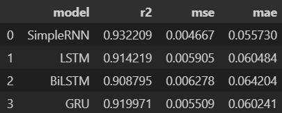

.. v2g documentation master file, created by
   sphinx-quickstart on Fri May 30 00:04:02 2025.
   You can adapt this file completely to your liking, but it should at least
   contain the root `toctree` directive.

Intelligent Energy Management System with V2G Technology
========================================================

I. Introduction
===============

V2G: Vehicle-to-Grid
--------------------

**Vehicle-to-Grid (V2G)** is an innovative technology that enables two-way energy flow between electric vehicles (EVs) and the power grid. Unlike traditional EV charging, V2G allows EVs not only to charge from the grid but also to return stored energy when needed. This capability supports **grid stability**, **reduces peak demand**, and enhances the **integration of renewable energy sources**.

V2G is already being deployed in several countries, including **Japan**, **the United States**, **the United Kingdom**, and **the Netherlands**, where it helps balance the power grid and reduce energy costs. In Japan, for example, V2G plays a key role in disaster recovery strategies by allowing EVs to power homes and essential services during outages.

This growing ecosystem shows how V2G is becoming a central component in modern smart grid and energy management systems.

Project Overview
-----------------

This project introduces an intelligent energy management system that leverages Vehicle-to-Grid (V2G) technology to optimize electricity production costs. The system predicts electricity load and the availability of other energy sources to determine the best times to utilize V2G energy, thereby maximizing efficiency and minimizing overall energy costs.

II. Team
==========

Supervisor
----------

* **Masrour Tawfik**  
  `LinkedIn <https://www.linkedin.com/in/tawfik-masrour-43163b85/>`_

Members
-------

* **Marouane Majidi**  
  `LinkedIn <https://www.linkedin.com/in/marouane-majidi-73abb81ab/>`_

* **Sohaib Daoudi**  
  `LinkedIn <https://www.linkedin.com/in/sohaib-daoudi-61215426a/>`_

III. Data Collection
====================

1. MATLAB Simulation
--------------------

We implemented a custom **Vehicle-to-Grid (V2G)** simulation in **MATLAB Simulink**, inspired by the official example from MathWorks:  
`24-Hour Simulation of a V2G System <https://www.mathworks.com/help/sps/ug/24-hour-simulation-of-a-vehicle-to-grid-v2g-system.html>`_.

While our simulation is based on this reference, we made several changes and enhancements to better reflect **local conditions**, **vehicle behavior**, and **energy sources** specific to our use case.

.. image:: images/simulation.png
   :alt: Custom V2G Simulation in MATLAB Simulink
   :align: center
   :width: 90%

Input Data
~~~~~~~~~~~~~

Our simulation required the following inputs:

- **Solar Irradiance**:  
  Collected from NASA's POWER Data Access Viewer:  `https://power.larc.nasa.gov/ <https://power.larc.nasa.gov/>`_  
  
  This dataset provides reliable, global irradiance information and is particularly useful for regions like **Meknès, Morocco**, where we conducted our case study.

- **Shading**:  
  Simulates the effect of clouds on solar irradiance throughout the day.

  .. code-block:: python

      def simulate_shading(timestamp):
          """ Simulate shading factor based on the timestamp.
              Returns a value between 0 (full shading) and 1 (no shading).
          """
          month = timestamp.month
          hour = timestamp.hour

          # Summer (June to September) - mostly no shading
          if 6 <= month <= 9:
              base_shading = 0.9 if 6 <= hour <= 18 else 0.7
          # Winter (November to February) - mostly shading
          elif 11 <= month <= 2:
              base_shading = 0.3 if 6 <= hour <= 18 else 0.2
          # Spring and Fall (March to May, October)
          else:
              base_shading = 0.7 if 6 <= hour <= 18 else 0.5

          # Introduce random fluctuation for each hour
          fluctuation = np.random.uniform(-0.1, 0.1)
          shading_value = base_shading + fluctuation
          shading_value = np.clip(shading_value, 0, 1)

          return round(shading_value, 2)

- **Load Profiles**:  
  Generated using custom Python scripts that simulate residential demand based on Moroccan usage patterns.

  .. code-block:: python

      def generate_load_profile(date, hour):
          """Generate synthetic load value for given datetime and hour"""
          # Base daily pattern (evening peak at ~6:30 PM)
          if date.weekday() < 5:  # Weekdays
              base_pattern = [0.12, 0.10, 0.08, 0.07, 0.07, 0.15, 0.25, 0.40, 0.55,
              0.60, 0.65, 0.60, 0.55, 0.50, 0.55, 0.65, 0.75, 0.85, 0.95, 0.85,
              0.70, 0.50, 0.30, 0.20]

          else:  # Weekends (Friday & Saturday)
              base_pattern = [0.15, 0.12, 0.10, 0.09, 0.09, 0.20, 0.30, 0.45, 0.60,
              0.70, 0.75, 0.80, 0.75, 0.70, 0.75, 0.80, 0.85, 0.90, 0.92, 0.85,
              0.75, 0.60, 0.40, 0.25]

          # Seasonal adjustment (winter = Nov-Feb)
          month = date.month
          if month in [11, 12, 1, 2]:  # Winter
              multiplier = 1.25
          elif month in [6, 7, 8]:  # Summer
              multiplier = 0.85
          else:  # Shoulder seasons
              multiplier = 1.0
          
          # Get base value
          value = base_pattern[hour]
          
          # Apply seasonal multiplier
          value *= multiplier
          
          # Add random fluctuation (±8%)
          value *= np.random.uniform(0.92, 1.08)
          
          # Ensure value < 1 and reasonable minimum
          return min(max(value, 0.05), 0.99)

Output Data
~~~~~~~~~~~

Our simulation produces two key output time series:

- **Total Load**:  
  Represents the complete electricity demand profile, including both household consumption and vehicle charging requirements.

- **Solar Energy Production**:  
  Captures the amount of energy generated by the solar PV system over time, based on irradiance and shading factors.

2. Other Data
-------------

- **Diesel Price (Weekly)**:  
  This data is sourced from 
  **U.S. Energy Information Administration (EIA)**:  
  `https://www.eia.gov/opendata/ <https://www.eia.gov/opendata/>`_ 
 
  Provides diesel price data in **USD per gallon**. We use this data when Moroccan sources are unavailable or for comparative analysis.

  To convert this data into **MAD per liter**, we apply the following formula:

  .. math::

     \text{MAD_per_liter} = \text{USD_per_gallon} \times 0.26417205 \times 10

  - `0.26417205` is the conversion factor from gallons to liters  
  - `10` is the approximate exchange rate used to convert USD to Moroccan Dirham (MAD)

3. Conclusion
-------------

In summary, our data collection and simulation efforts result in four key time series that serve as the foundation for our energy management analysis:

- **Load**: Total electricity demand, including residential and vehicle charging (MW).  
- **Energy Available in EVs**: The energy stored and potentially available in connected electric vehicles through the V2G system (MW).  
- **Solar Energy**: Energy generated by the solar PV system, influenced by irradiance and shading factors (MW).  
- **Diesel Price**: Weekly diesel prices in Moroccan Dirham per liter (DH/L).

These time series provide comprehensive inputs and outputs for modeling, forecasting, and optimizing the local energy ecosystem.

IV. Training Models
===================

.. note::

   All time series are processed through a pipeline that includes the following steps.  
   Below, we describe the steps for the load time series as an example—other time series follow a similar process.

1. Data Preparation
-------------------

The time series data comes from a simulation where time is represented in seconds (0, 3600, ..., 18907200).
We convert this to hourly timestamps starting from ``2022-06-07 00:00:00`` and ending at ``2023-01-11 20:00:00``.

.. code-block:: python

    cons_df = pd.read_excel(dir_path + 'Total_Load.xlsx')
    start_date = pd.to_datetime('2022-06-07 00:00:00')
    cons_df['Time'] = start_date + pd.to_timedelta(cons_df['Time'], unit='s')

2. Statistical Approach
-----------------------

2.1. Stationarity Analysis
~~~~~~~~~~~~~~~~~~~~~~~~~~

2.1.1. Visual Inspection
^^^^^^^^^^^^^^^^^^^^^^^^

We plot the time series to visually check for stationarity.

.. image:: images/Load_plot.png
    :alt: Consumption Time Series Plot
    :align: center
    :width: 90%

2.1.2. Augmented Dickey-Fuller Test
^^^^^^^^^^^^^^^^^^^^^^^^^^^^^^^^^^^

We apply the Augmented Dickey-Fuller (ADF) test to check for stationarity. The null hypothesis is that the time series is non-stationary.

.. code-block:: python

    from statsmodels.tsa.stattools import adfuller
    result = adfuller(cons_df['Load'])
    print('ADF Statistic: %f' % result[0])
    print('P-value: %f' % result[1])

2.1.3. Kwiatkowski-Phillips-Schmidt-Shin (KPSS) Test
^^^^^^^^^^^^^^^^^^^^^^^^^^^^^^^^^^^^^^^^^^^^^^^^^^^^

The KPSS test checks for stationarity around a deterministic trend. The null hypothesis is that the time series is stationary.

.. code-block:: python

    from statsmodels.tsa.stattools import kpss
    import warnings
    warnings.filterwarnings("ignore")
    result = kpss(cons_df['Load'])
    print('KPSS Statistic: %f' % result[0])
    print('P-value: %f' % result[1])

2.1.4. Phillips-Perron (PP) Test
^^^^^^^^^^^^^^^^^^^^^^^^^^^^^^^^

The PP test is another method to check for unit roots in the time series.

.. code-block:: python

    from arch.unitroot import PhillipsPerron
    result = PhillipsPerron(cons_df['Load'])
    print('PP Statistic: %f' % result.stat)
    print('P-value: %f' % result.pvalue)

2.2. Differencing
~~~~~~~~~~~~~~~~~

If the time series is non-stationary, we apply differencing to make it stationary. We check the ADF test again after differencing.

.. code-block:: python

    consumption_diff = cons_df['Load'].diff().dropna()

2.3. SARIMA Model
~~~~~~~~~~~~~~~~~

2.3.1. Initial Parameter Selection
^^^^^^^^^^^^^^^^^^^^^^^^^^^^^^^^^^

- **ACF & PACF Analysis**: We plot the autocorrelation function (ACF) and partial autocorrelation function (PACF) to identify potential parameters for the SARIMA model.

  .. image:: images/acf_pacf.png
     :alt: ACF and PACF Plots
     :align: center
     :width: 90%

Based on the ACF and PACF plots, we select the initial SARIMA parameters as follows:

- **d = 1**: Chosen based on stationarity tests and the need for seasonal differencing.
- **p = 24**: Indicated by significant spikes in the PACF plot, suggesting a seasonal autoregressive component.
- **q = 23**: Derived from the ACF plot, which shows strong autocorrelations up to lag 23, followed by a sharp drop.
- **s = 24**: Represents the seasonal period — 24 hours for daily seasonality in hourly data.
- **P = 1**: The seasonal PACF reveals a spike at lag 24 and its multiples (e.g., 48), indicating a seasonal autoregressive pattern.
- **Q = 1**: The seasonal ACF shows a peak at lag 24, which gradually decays, suggesting a seasonal moving average component.

.. code-block:: python

    from statsmodels.tsa.statespace.sarimax import SARIMAX

    # Define SARIMA parameters
    p, d, q = 1, 1, 23
    P, D, Q, s = 0, 1, 1, 24
    # P = 0 to avoid the overlap of lags between the seasonal and non-seasonal components.

    # Fit the SARIMA model
    model = SARIMAX(train, order=(p, d, q), seasonal_order=(P, D, Q, s))
    model_fit = model.fit()

2.3.2. Hyperparameter Tuning
^^^^^^^^^^^^^^^^^^^^^^^^^^^^

To fine-tune the SARIMA model parameters, we use the `pmdarima` library's `auto_arima` function. This helps identify the optimal combination of non-seasonal and seasonal parameters by minimizing the AIC score.

.. code-block:: python

    import pmdarima as pm

    # Initial parameter guesses
    p, d, q = 1, 1, 1            # Non-seasonal components
    P, D, Q, s = 0, 1, 1, 24     # Seasonal components

    # Perform automatic hyperparameter tuning
    auto_model = pm.auto_arima(
        train, 
        seasonal=True, 
        m=s,
        start_p=p, start_q=q, start_P=P, start_Q=Q,
        max_p=24, max_q=24, max_P=1, max_Q=1, max_D=1,
        d=d, 
        trace=True,
        error_action='ignore', 
        suppress_warnings=True,
        n_jobs=-1
    )

The tuning process identified the **optimal SARIMA parameters** that minimized the AIC:

- **(p, d, q) = (3, 0, 7)**
- **(P, D, Q, s) = (1, 1, 1, 24)**

The model achieved the **lowest AIC score** of **13406.305** with these settings.

2.4. Prophet Model
~~~~~~~~~~~~~~~~~~
We use the `Prophet` library to model the time series, which is particularly effective for capturing seasonality and trends in time series data.

.. code-block:: python

    from prophet import Prophet

    # Prepare the data for Prophet
    prophet_df = cons_df.rename(columns={'Time': 'ds', 'Load': 'y'})

    # Initialize and fit the Prophet model
    prophet_model = Prophet(
        daily_seasonality=True, 
        yearly_seasonality=False, 
        weekly_seasonality=False
    )
    prophet_model.fit(prophet_df)

3. Deep Learning Approach
-------------------------

3.1. Data Preparation
~~~~~~~~~~~~~~~~~~~~~
To train deep learning models such as LSTM or GRU, we first format the time series into sequences suitable for supervised learning.

.. code-block:: python

    def create_dataset(serie, time_steps=1):
        Xs, ys = [], []
        for i in range(len(serie) - time_steps):
            Xs.append(serie.iloc[i:(i + time_steps)].values)
            ys.append(serie.iloc[i + time_steps])
        return np.array(Xs), np.array(ys)

We also scale the data using ``MinMaxScaler`` to normalize the values between 0 and 1, which improves convergence and training stability for neural networks.

3.2. Models
~~~~~~~~~~~
We train various deep learning models, including LSTM, GRU, RNN, and Bidirectional LSTM, on the prepared data. Each model is evaluated using performance metrics such as RMSE and MAE.

We use `Keras Tuner` to automatically search for the best hyperparameters.

**Example: RNN Model with Keras Tuner and GPU Strategy**

.. code-block:: python

    import tensorflow as tf
    import keras_tuner as kt
    from tensorflow import keras

    # Enable GPU support with distributed strategy
    strategy = tf.distribute.MirroredStrategy()
    print(f"Number of devices: {strategy.num_replicas_in_sync}")

    def model_builder_simpleRNN(hp):
        model = tf.keras.Sequential()

        # Hyperparameter search space
        hp_units = hp.Int('units', min_value=32, max_value=512, step=32)
        hp_activation = hp.Choice('activation', ['relu', 'tanh'])

        model.add(tf.keras.layers.SimpleRNN(units=hp_units, activation=hp_activation, input_shape=(window_size, 1)))
        model.add(tf.keras.layers.Dense(1, activation='relu'))

        hp_learning_rate = hp.Choice('learning_rate', [1e-2, 1e-3, 1e-4])
        model.compile(optimizer=keras.optimizers.Adam(learning_rate=hp_learning_rate),
                      loss='mse')

        return model

    stop_early = tf.keras.callbacks.EarlyStopping(monitor='val_loss', patience=5)

    # Run the hyperparameter search within GPU scope
    with strategy.scope():
        tuner_simRNN = kt.Hyperband(
            model_builder_simpleRNN,
            objective='val_loss',
            max_epochs=10,
            factor=3,
            directory='my_dir',
            project_name='simpleRNN'
        )

    tuner_simRNN.search(X_train, y_train, epochs=50, validation_data=(X_val, y_val), callbacks=[stop_early])

3.3. Model Evaluation
~~~~~~~~~~~~~~~~~~~~~~~~~~~~~~
we evaluate the trained models on a test set using metrics such as Mean Squared Error (MSE), Mean Absolute Error (MAE), and R-squared (R²). 
we choose the best-performing model based on these metrics.

.. code-block:: python

    from sklearn.metrics import r2_score

    mse_lstm = np.mean((predictions_lstm - y_test) ** 2)
    mae_lstm = np.mean(np.abs(predictions_lstm - y_test))
    r2_lstm = r2_score(y_test, predictions_lstm)

    mse_rnn = np.mean((predictions_rnn - y_test) ** 2)
    mae_rnn = np.mean(np.abs(predictions_rnn - y_test))
    r2_rnn = r2_score(y_test, predictions_rnn)

    mse_gru = np.mean((predictions_gru - y_test) ** 2)
    mae_gru = np.mean(np.abs(predictions_gru - y_test))
    r2_gru = r2_score(y_test, predictions_gru)

    mse_cnn = np.mean((predictions_cnn - y_test) ** 2)
    mae_cnn = np.mean(np.abs(predictions_cnn - y_test))
    r2_cnn = r2_score(y_test, predictions_cnn)

    mse_bi_lstm = np.mean((predictions_bi_lstm - y_test) ** 2)
    mae_bi_lstm = np.mean(np.abs(predictions_bi_lstm - y_test))
    r2_bi_lstm = r2_score(y_test, predictions_bi_lstm)

V. Optimisation
===============

The optimization phase focuses on determining the optimal times to utilize V2G energy based on the predicted load and available energy from solar PV systems.  
The goal is to minimize electricity costs while ensuring grid stability.

1. Optimization Problem Formulation
-----------------------------------

V2G Energy Cost Optimization Problem
^^^^^^^^^^^^^^^^^^^^^^^^^^^^^^^^^^^^

**Mathematical Formulation**

**Objective:** Minimize the total energy cost over a time horizon of :math:`T` hours.

.. math::

   \min_{d_t, v_t, s_t} \sum_{t=1}^{T} \left( d_t \cdot p_t^{\text{diesel}} + v_t \cdot p^{\text{v2g}} \right)

**Subject to the following constraints:**

.. math::

   \text{(1) Energy balance:} \quad s_t + v_t + d_t \geq L_t \quad \forall t = 1, \dots, T

.. math::

   \text{(2) Solar availability:} \quad s_t \leq S_t \quad \forall t

.. math::

   \text{(3) V2G availability:} \quad v_t \leq V_t \quad \forall t

.. math::

   \text{(4) V2G binary activation:} \quad v_t \leq M \cdot b_t \quad \forall t

.. math::

   \text{(5) Max V2G usage hours per day:} \quad \sum_{t \in \mathcal{D}_k} b_t \leq H_{\text{v2g}} \quad \forall \text{day } k

.. admonition:: Remark

   Although some constraints (such as energy balance, solar availability, ...) logically suggest an equality (i.e., total energy supplied equals total demand), we use a "greater than or equal to" (:math:`\geq`) formulation.  
   This provides numerical flexibility to the solver, avoids infeasibility due to rounding or prediction errors, and ensures better convergence when dealing with real-world uncertainties in the data.

**Variable Definitions:**

- :math:`T`: Total number of hours  
- :math:`L_t`: Predicted load at hour :math:`t`  
- :math:`S_t`: Predicted solar availability at hour :math:`t`  
- :math:`V_t`: Predicted V2G availability at hour :math:`t`  
- :math:`d_t`: Diesel energy used at hour :math:`t`  
- :math:`v_t`: V2G energy used at hour :math:`t`  
- :math:`s_t`: Solar energy used at hour :math:`t`  
- :math:`p_t^{\text{diesel}}`: Diesel price at hour :math:`t`  
- :math:`p^{\text{v2g}}`: Fixed price per unit of V2G energy  
- :math:`b_t \in \{0,1\}`: Binary variable indicating whether V2G is used at hour :math:`t`  
- :math:`M`: Large constant (big-M) used to link :math:`v_t` and :math:`b_t`  
- :math:`\mathcal{D}_k`: Set of hour indices in day :math:`k`  
- :math:`H_{\text{v2g}}`: Maximum number of hours per day where V2G can be used

.. code-block:: python

    import cvxpy as cp

    def optimize_with_v2g(load_pred, solar_pred, v2g_pred, hours, diesel_prices, v2g_price=200, max_v2g_hours=3):
        """
        Optimize energy usage with V2G integration.
        
        Parameters:
        -----------
        load_pred : array-like
            Predicted load values
        solar_pred : array-like
            Predicted solar generation values
        v2g_pred : array-like
            Predicted V2G availability values
        hours : int
            Number of hours to optimize
        diesel_prices : array-like
            Hourly diesel prices in MAD/MWh (can be constant or time-varying)
        v2g_price : float
            Price of V2G energy in MAD/MWh
        max_v2g_hours : int
            Maximum hours per day to use V2G
            
        Returns:
        --------
        dict
            Optimization results
        """
        try:
            # Decision variables
            solar_used = cp.Variable(hours, nonneg=True)
            v2g_used = cp.Variable(hours, nonneg=True)
            diesel_used = cp.Variable(hours, nonneg=True)
            
            # Objective function: Minimize total cost with time-varying diesel prices
            total_cost = (cp.sum(cp.multiply(diesel_used, diesel_prices)) + 
                        cp.sum(cp.multiply(v2g_used, v2g_price)))
            objective = cp.Minimize(total_cost)
            
            # Constraints
            constraints = []
            
            for t in range(hours):
                constraints.append(solar_used[t] + v2g_used[t] + diesel_used[t] >= load_pred[t])
                constraints.append(solar_used[t] <= solar_pred[t])
                constraints.append(v2g_used[t] <= v2g_pred[t])
            
            # V2G usage time constraint
            v2g_binary = cp.Variable(hours, boolean=True)
            M = 1000  # Big-M value
            
            for t in range(hours):
                constraints.append(v2g_used[t] <= M * v2g_binary[t])
            
            days = (hours + 23) // 24  # Number of full or partial days
            for d in range(days):
                start = d * 24
                end = min((d + 1) * 24, hours)
                constraints.append(cp.sum(v2g_binary[start:end]) <= max_v2g_hours)
            
            # Solve the problem using a solver that supports mixed-integer programming
            problem = cp.Problem(objective, constraints)
            for solver in [cp.ECOS_BB, cp.CBC, cp.GLPK_MI]:
                try:
                    if solver == cp.ECOS_BB:
                        problem.solve(solver=solver, abstol=1e-4, reltol=1e-4, feastol=1e-4)
                    else:
                        problem.solve(solver=solver)

                    if problem.status in [cp.OPTIMAL, cp.OPTIMAL_INACCURATE]:
                        break
                except:
                    continue

            if problem.status not in [cp.OPTIMAL, cp.OPTIMAL_INACCURATE]:
                return {'status': 'Failed', 'message': f'Problem status: {problem.status}'}

            total_diesel_cost = float(sum(diesel_used.value[i] * diesel_prices[i] for i in range(hours)))
            total_v2g_energy = float(np.sum(v2g_used.value))
            total_v2g_cost = total_v2g_energy * v2g_price

            return {
                'status': 'Success',
                'solar_used': solar_used.value,
                'v2g_used': v2g_used.value,
                'diesel_used': diesel_used.value,
                'total_diesel_energy': float(np.sum(diesel_used.value)),
                'total_diesel_cost': total_diesel_cost,
                'total_v2g_energy': total_v2g_energy,
                'total_v2g_cost': total_v2g_cost,
                'total_cost': total_diesel_cost + total_v2g_cost
            }
            
        except Exception as e:
            return {'status': 'Error', 'message': str(e)}

2. From forecasting to optimization
-----------------------------------

2.1. From diesel price to cost energy
~~~~~~~~~~~~~~~~~~~~~~~~~~~~~~~~~~~~~

The first challenge is converting the diesel price into the cost of energy generated by the diesel generator.  
This calculation is based on the methodology from this paper:  
https://www.dpi.nsw.gov.au/__data/assets/pdf_file/0011/665660/comparing-running-costs-of-diesel-lpg-and-electrical-pumpsets.pdf

The diesel generator's cost per MWh is calculated using the formula:

.. math::

   \text{Cost per MWh} = \left( \frac{\text{Cost per litre}}{\text{Specific energy}} \right) \times \left( \frac{1}{\text{Engine efficiency}} \right) \times \left( \frac{1}{0.278} \right) \times 1000

Where:

- **specific_energy = 38 (MJ/litre)**
- **efficiency = 0.35  (35% engine efficiency)**
- **mj_to_kwh = 0.278  (1 MJ = 0.278 kWh)**

.. code-block:: python

    def diesel_cost_per_mwh(prices_mad_per_liter):
        """
        Calculate the cost per MWh (mechanical energy) from diesel prices (MAD per liter).

        Parameters:
        -----------
        prices_mad_per_liter : np.ndarray or list
            Diesel prices in MAD per liter.

        Returns:
        --------
        np.ndarray
            Diesel costs in MAD per MWh.
        """
        # Constants
        specific_energy = 38  # MJ/litre
        efficiency = 0.35     # 35% engine efficiency
        mj_to_kwh = 0.278     # Conversion factor: 1 MJ = 0.278 kWh

        # Compute cost per MWh
        cost_per_mwh = (prices_mad_per_liter / specific_energy) * (1 / efficiency) * (1 / mj_to_kwh) * 1000

        return cost_per_mwh

2.2. From weekly to hourly diesel energy cost
~~~~~~~~~~~~~~~~~~~~~~~~~~~~~~~~~~~~~~~~~~~~~
Our diesel prices are provided on a weekly basis, but our energy optimization requires hourly diesel costs.  
To address this, we map weekly diesel prices to hourly timestamps by assigning each hour the diesel price from the most recent week available.

.. code-block:: python

    def map_weekly_to_hourly_prices(hourly_dates, diesel_prices, diesel_dates):
        """
        Map weekly diesel prices to an hourly time series.

        For each hourly timestamp, this function assigns the diesel price from the latest
        weekly price date that is less than or equal to the hour's date.

        Parameters:
        -----------
        hourly_dates : pd.Series or array-like
            Array of hourly timestamps (datetime).
        diesel_prices : array-like
            List or array of diesel prices corresponding to weekly intervals.
        diesel_dates : pd.Series or array-like
            Array of datetime objects indicating the start dates of weekly diesel prices.

        Returns:
        --------
        np.ndarray
            Array of diesel prices mapped to each hourly timestamp.
        """
        hourly_diesel_prices = np.zeros(len(hourly_dates))

        # Ensure datetime format for consistency
        hourly_dates = pd.to_datetime(hourly_dates)
        diesel_dates = pd.to_datetime(diesel_dates)

        for i, hour_date in enumerate(hourly_dates):
            # Identify all diesel price dates that are less than or equal to the current hour
            valid_dates = diesel_dates <= hour_date

            if valid_dates.any():
                # Use the most recent diesel price available before or at this hour
                closest_index = np.where(valid_dates)[0][-1]
                hourly_diesel_prices[i] = diesel_prices[closest_index]
            else:
                # If no previous diesel price exists (e.g., very early dates), use the first available price
                hourly_diesel_prices[i] = diesel_prices[0]

        return hourly_diesel_prices

2.3. Example of optimization
~~~~~~~~~~~~~~~~~~~~~~~~~~~~~~~
.. image:: images/Optimisation_vis.png
   :alt: Optimization Example
   :align: center
   :width: 90%

VI. Dashboard with Streamlit
=============================

To run the application (Dashboard), visit the GitHub repository:

- https://github.com/MarouaneMajidi/Intelligent-Energy-Management-System-with-V2G-Technology  

- https://github.com/sohaibdaoudi/V2G_TS_Project

Main Workflow
-------------

**Step 1: Load Models and Set Parameters**

Load the pre-trained models and historical data. Configure the parameters for optimization:

- **Forecast duration**: Number of hours for forecasting load and solar energy.
- **Diesel price input**: Choose between a time series or a constant value.
- **V2G price**: Cost of V2G energy in MAD per MWh.
- **Maximum V2G hours**: Maximum number of hours per day that V2G energy can be used.

.. image:: images/step1.png
   :alt: Step 1 - Set Parameters
   :align: center
   :width: 90%

|

**Step 2: Run Optimization and View Results**

Execute the optimization process and analyze the outcomes visually through interactive plots.

.. image:: images/step2.png
   :alt: Step 2 - Optimization Results
   :align: center
   :width: 90%

|

Additional Features
--------------------

**Download Energy Analysis Results**

Export the energy cost and distribution results in CSV format for external analysis.

.. image:: images/step3.png
   :alt: Download CSV Results
   :align: center
   :width: 90%

|

**Download Summary Report**

Generate and download a detailed energy optimization report in PDF or markdown format.

.. image:: images/step4.png
   :alt: Download Report
   :align: center
   :width: 90%

|

**Retrain Models with Real-Time Data**

The dashboard allows users to upload real-world operational data to retrain and update forecasting models.

